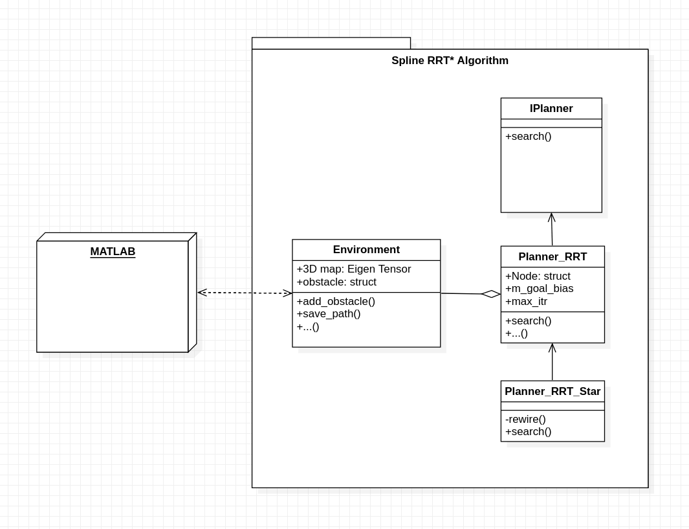
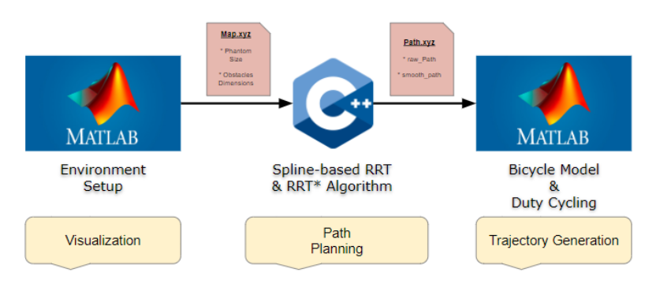

# Visual Servoing - SCARA Robot

## Overview
This is the final project for the course, "RBE 550 - Motion Planning" at WPI. In this project, the main goal was to develop a motion planning algorithm for a steerable needle robot built at AIM Lab, WPI. The detailed report can be found in the "Report" folder. 

For a quick reference, here's a brief of all that was explored and implemented from scratch:
- [MATLAB] Kinematic Modelling of the needle as a modified Bicylce model.
- [C++] Spline-based RRT and RRT* algorithms for path planning in 3D space.
- [MATLAB] Duty-cycling and CURV steering methods for trajectory planning.

---
## Class Diagram of Path Planning Algorithms
<figure>
    
</figure>
<br>


---
## System Integration
<figure>
    
</figure>

> :information_source: The following block diagram gives a quick overview of the logic employed to perform the Visual Servoing.


---
## Building

To build from source, clone the latest version from this repository into your catkin workspace and compile the package using

	```bash
	$ cd catkin_workspace/src
	$ git clone https://github.com/emmanuel-logy/visual_servoing_scara.git
	$ catkin_make
	```
---
